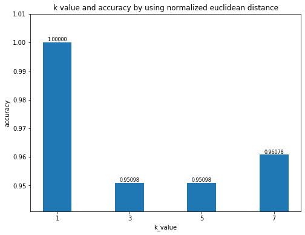
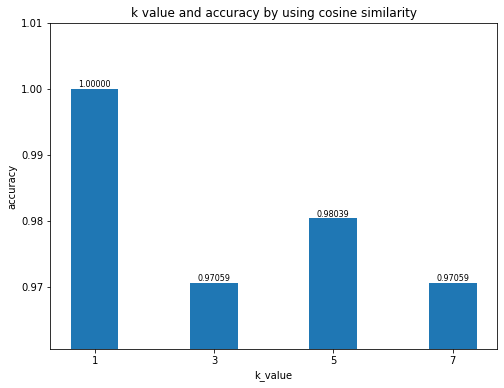
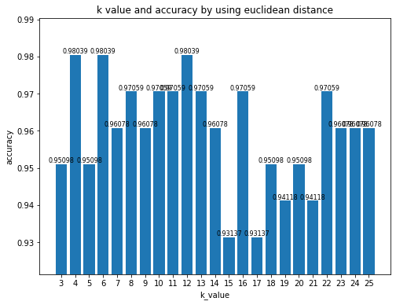
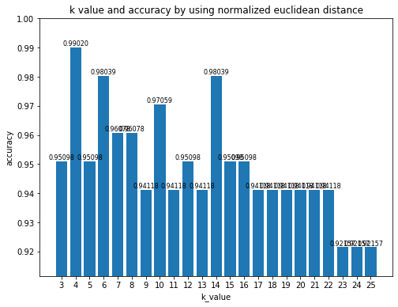
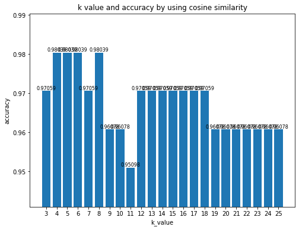
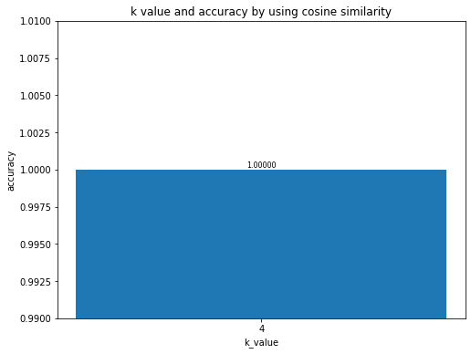
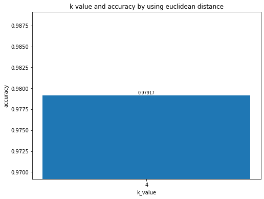
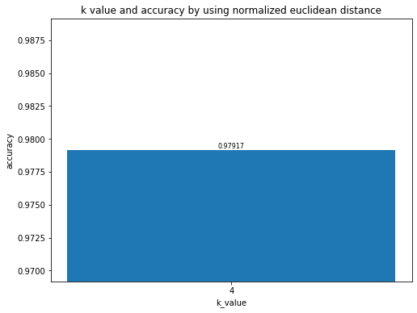

```python
import numpy as np
from collections import Counter #Just use Counter to count number
from csv import reader
import random
import matplotlib.pyplot as plt
```

# a.load data & split data to dev test


```python
def loadDataset(filename,split):
    devSet=[]
    testSet = []
    with open(filename, 'r') as file:
        csv_reader = reader(file)
        dataset = list(csv_reader)
        for x in range(len(dataset)-1):  
            for y in range(4):  
                dataset[x][y] = float(dataset[x][y])  
            if random.random()<split:  
                devSet.append(dataset[x])  
            else:  
                testSet.append(dataset[x])
    y_dev = np.array([xx.pop(-1) for xx in devSet])
    x_dev = np.array(devSet)
    y_test = np.array([xx.pop(-1) for xx in testSet])
    x_test = np.array(testSet)
    return x_dev,x_test,y_dev,y_test

filename = "iris.data"
split = 0.67
x_dev,x_test,y_dev,y_test=loadDataset(filename, split)
print("Dev set" + repr(len(x_dev)))  
print("Test set"+ repr(len(x_test)))
print(x_dev)  
print(y_dev)
print(x_test)  
print(y_test)
```

    Dev set102
    Test set48
    [[4.9 3.  1.4 0.2]
     [4.6 3.1 1.5 0.2]
     [5.4 3.9 1.7 0.4]
     [4.6 3.4 1.4 0.3]
     [5.  3.4 1.5 0.2]
     [4.4 2.9 1.4 0.2]
     [4.8 3.  1.4 0.1]
     [5.7 4.4 1.5 0.4]
     [5.4 3.9 1.3 0.4]
     [5.1 3.5 1.4 0.3]
     [5.7 3.8 1.7 0.3]
     [5.1 3.8 1.5 0.3]
     [5.1 3.7 1.5 0.4]
     [4.6 3.6 1.  0.2]
     [5.1 3.3 1.7 0.5]
     [4.8 3.4 1.9 0.2]
     [5.  3.  1.6 0.2]
     [5.2 3.5 1.5 0.2]
     [4.7 3.2 1.6 0.2]
     [4.8 3.1 1.6 0.2]
     [5.4 3.4 1.5 0.4]
     [5.  3.2 1.2 0.2]
     [5.5 3.5 1.3 0.2]
     [4.9 3.1 1.5 0.1]
     [4.4 3.  1.3 0.2]
     [5.1 3.4 1.5 0.2]
     [4.4 3.2 1.3 0.2]
     [5.  3.5 1.6 0.6]
     [4.8 3.  1.4 0.3]
     [5.1 3.8 1.6 0.2]
     [5.3 3.7 1.5 0.2]
     [5.  3.3 1.4 0.2]
     [7.  3.2 4.7 1.4]
     [6.9 3.1 4.9 1.5]
     [6.5 2.8 4.6 1.5]
     [5.7 2.8 4.5 1.3]
     [6.3 3.3 4.7 1.6]
     [6.6 2.9 4.6 1.3]
     [5.  2.  3.5 1. ]
     [5.9 3.  4.2 1.5]
     [6.  2.2 4.  1. ]
     [6.1 2.9 4.7 1.4]
     [6.7 3.1 4.4 1.4]
     [5.6 3.  4.5 1.5]
     [5.8 2.7 4.1 1. ]
     [6.2 2.2 4.5 1.5]
     [5.9 3.2 4.8 1.8]
     [6.1 2.8 4.  1.3]
     [6.3 2.5 4.9 1.5]
     [6.1 2.8 4.7 1.2]
     [6.4 2.9 4.3 1.3]
     [6.7 3.  5.  1.7]
     [5.5 2.4 3.8 1.1]
     [5.5 2.4 3.7 1. ]
     [5.8 2.7 3.9 1.2]
     [6.  2.7 5.1 1.6]
     [5.4 3.  4.5 1.5]
     [5.6 3.  4.1 1.3]
     [6.1 3.  4.6 1.4]
     [5.8 2.6 4.  1.2]
     [5.  2.3 3.3 1. ]
     [5.7 3.  4.2 1.2]
     [5.7 2.9 4.2 1.3]
     [6.2 2.9 4.3 1.3]
     [5.1 2.5 3.  1.1]
     [5.7 2.8 4.1 1.3]
     [7.1 3.  5.9 2.1]
     [6.3 2.9 5.6 1.8]
     [6.5 3.  5.8 2.2]
     [7.6 3.  6.6 2.1]
     [4.9 2.5 4.5 1.7]
     [7.3 2.9 6.3 1.8]
     [6.7 2.5 5.8 1.8]
     [7.2 3.6 6.1 2.5]
     [6.5 3.2 5.1 2. ]
     [6.8 3.  5.5 2.1]
     [5.7 2.5 5.  2. ]
     [5.8 2.8 5.1 2.4]
     [6.5 3.  5.5 1.8]
     [7.7 3.8 6.7 2.2]
     [7.7 2.6 6.9 2.3]
     [6.  2.2 5.  1.5]
     [6.9 3.2 5.7 2.3]
     [6.3 2.7 4.9 1.8]
     [7.2 3.2 6.  1.8]
     [6.4 2.8 5.6 2.1]
     [7.2 3.  5.8 1.6]
     [7.4 2.8 6.1 1.9]
     [7.9 3.8 6.4 2. ]
     [6.4 2.8 5.6 2.2]
     [6.1 2.6 5.6 1.4]
     [7.7 3.  6.1 2.3]
     [6.  3.  4.8 1.8]
     [6.9 3.1 5.4 2.1]
     [6.9 3.1 5.1 2.3]
     [6.8 3.2 5.9 2.3]
     [6.7 3.3 5.7 2.5]
     [6.7 3.  5.2 2.3]
     [6.3 2.5 5.  1.9]
     [6.5 3.  5.2 2. ]
     [6.2 3.4 5.4 2.3]
     [5.9 3.  5.1 1.8]]
    ['Iris-setosa' 'Iris-setosa' 'Iris-setosa' 'Iris-setosa' 'Iris-setosa'
     'Iris-setosa' 'Iris-setosa' 'Iris-setosa' 'Iris-setosa' 'Iris-setosa'
     'Iris-setosa' 'Iris-setosa' 'Iris-setosa' 'Iris-setosa' 'Iris-setosa'
     'Iris-setosa' 'Iris-setosa' 'Iris-setosa' 'Iris-setosa' 'Iris-setosa'
     'Iris-setosa' 'Iris-setosa' 'Iris-setosa' 'Iris-setosa' 'Iris-setosa'
     'Iris-setosa' 'Iris-setosa' 'Iris-setosa' 'Iris-setosa' 'Iris-setosa'
     'Iris-setosa' 'Iris-setosa' 'Iris-versicolor' 'Iris-versicolor'
     'Iris-versicolor' 'Iris-versicolor' 'Iris-versicolor' 'Iris-versicolor'
     'Iris-versicolor' 'Iris-versicolor' 'Iris-versicolor' 'Iris-versicolor'
     'Iris-versicolor' 'Iris-versicolor' 'Iris-versicolor' 'Iris-versicolor'
     'Iris-versicolor' 'Iris-versicolor' 'Iris-versicolor' 'Iris-versicolor'
     'Iris-versicolor' 'Iris-versicolor' 'Iris-versicolor' 'Iris-versicolor'
     'Iris-versicolor' 'Iris-versicolor' 'Iris-versicolor' 'Iris-versicolor'
     'Iris-versicolor' 'Iris-versicolor' 'Iris-versicolor' 'Iris-versicolor'
     'Iris-versicolor' 'Iris-versicolor' 'Iris-versicolor' 'Iris-versicolor'
     'Iris-virginica' 'Iris-virginica' 'Iris-virginica' 'Iris-virginica'
     'Iris-virginica' 'Iris-virginica' 'Iris-virginica' 'Iris-virginica'
     'Iris-virginica' 'Iris-virginica' 'Iris-virginica' 'Iris-virginica'
     'Iris-virginica' 'Iris-virginica' 'Iris-virginica' 'Iris-virginica'
     'Iris-virginica' 'Iris-virginica' 'Iris-virginica' 'Iris-virginica'
     'Iris-virginica' 'Iris-virginica' 'Iris-virginica' 'Iris-virginica'
     'Iris-virginica' 'Iris-virginica' 'Iris-virginica' 'Iris-virginica'
     'Iris-virginica' 'Iris-virginica' 'Iris-virginica' 'Iris-virginica'
     'Iris-virginica' 'Iris-virginica' 'Iris-virginica' 'Iris-virginica']
    [[5.1 3.5 1.4 0.2]
     [4.7 3.2 1.3 0.2]
     [5.  3.6 1.4 0.2]
     [4.9 3.1 1.5 0.1]
     [5.4 3.7 1.5 0.2]
     [4.8 3.4 1.6 0.2]
     [4.3 3.  1.1 0.1]
     [5.8 4.  1.2 0.2]
     [5.4 3.4 1.7 0.2]
     [5.  3.4 1.6 0.4]
     [5.2 3.4 1.4 0.2]
     [5.2 4.1 1.5 0.1]
     [5.5 4.2 1.4 0.2]
     [4.9 3.1 1.5 0.1]
     [5.  3.5 1.3 0.3]
     [4.5 2.3 1.3 0.3]
     [5.1 3.8 1.9 0.4]
     [4.6 3.2 1.4 0.2]
     [6.4 3.2 4.5 1.5]
     [5.5 2.3 4.  1.3]
     [4.9 2.4 3.3 1. ]
     [5.2 2.7 3.9 1.4]
     [5.6 2.9 3.6 1.3]
     [5.6 2.5 3.9 1.1]
     [6.6 3.  4.4 1.4]
     [6.8 2.8 4.8 1.4]
     [6.  2.9 4.5 1.5]
     [5.7 2.6 3.5 1. ]
     [6.  3.4 4.5 1.6]
     [6.7 3.1 4.7 1.5]
     [6.3 2.3 4.4 1.3]
     [5.5 2.5 4.  1.3]
     [5.5 2.6 4.4 1.2]
     [5.6 2.7 4.2 1.3]
     [6.3 3.3 6.  2.5]
     [5.8 2.7 5.1 1.9]
     [6.4 2.7 5.3 1.9]
     [6.4 3.2 5.3 2.3]
     [5.6 2.8 4.9 2. ]
     [7.7 2.8 6.7 2. ]
     [6.7 3.3 5.7 2.1]
     [6.2 2.8 4.8 1.8]
     [6.1 3.  4.9 1.8]
     [6.3 2.8 5.1 1.5]
     [6.3 3.4 5.6 2.4]
     [6.4 3.1 5.5 1.8]
     [6.7 3.1 5.6 2.4]
     [5.8 2.7 5.1 1.9]]
    ['Iris-setosa' 'Iris-setosa' 'Iris-setosa' 'Iris-setosa' 'Iris-setosa'
     'Iris-setosa' 'Iris-setosa' 'Iris-setosa' 'Iris-setosa' 'Iris-setosa'
     'Iris-setosa' 'Iris-setosa' 'Iris-setosa' 'Iris-setosa' 'Iris-setosa'
     'Iris-setosa' 'Iris-setosa' 'Iris-setosa' 'Iris-versicolor'
     'Iris-versicolor' 'Iris-versicolor' 'Iris-versicolor' 'Iris-versicolor'
     'Iris-versicolor' 'Iris-versicolor' 'Iris-versicolor' 'Iris-versicolor'
     'Iris-versicolor' 'Iris-versicolor' 'Iris-versicolor' 'Iris-versicolor'
     'Iris-versicolor' 'Iris-versicolor' 'Iris-versicolor' 'Iris-virginica'
     'Iris-virginica' 'Iris-virginica' 'Iris-virginica' 'Iris-virginica'
     'Iris-virginica' 'Iris-virginica' 'Iris-virginica' 'Iris-virginica'
     'Iris-virginica' 'Iris-virginica' 'Iris-virginica' 'Iris-virginica'
     'Iris-virginica']


# b.implement kNN using the following hyperparameters

## distance metric function

### euclidean distance


```python
def calculateEuclideanDistance(one_x_test,x_dev):
    one_x_test = one_x_test.reshape(1,-1)
    x_dev = x_dev.reshape(x_dev.shape[0],-1)
    x_test = np.tile(one_x_test,(x_dev.shape[0],1))
    distance = np.sqrt(np.power(x_test - x_dev,2).sum(axis=1))
    return distance
```

### normalized euclidean distance


```python
def calculateNormalizedEuclideanDistance(one_x_test,x_dev):
    x_standard = np.std(x_dev, axis=0)
    x_standard = x_standard.reshape(1,-1)
    one_x_test = one_x_test.reshape(1,-1)
    x_dev = x_dev.reshape(x_dev.shape[0],-1)
    x_test = np.tile(one_x_test,(x_dev.shape[0],1))
    x_std = np.tile(x_standard,(x_dev.shape[0],1))
    distance = np.sqrt(np.power((x_test - x_dev)/x_std,2).sum(axis=1))   
    return distance
```

### cosine similarity


```python
def calculateCosineSimilarity(one_x_test,x_dev):
    distance_arr = []
    for x in x_dev:
        distance = 1- np.dot(one_x_test,x)/(np.linalg.norm(one_x_test)*(np.linalg.norm(x)))
        distance_arr.append(distance)
    return distance_arr
```


```python
for one_x_test in x_dev:
    distance = calculateEuclideanDistance(one_x_test,x_dev)
    print(distance)
    distance2 = calculateCosineSimilarity(one_x_test,x_dev)
    print(distance2)
    distance3 = calculateNormalizedEuclideanDistance(one_x_test,x_dev)
    print(distance3)
    break
```

    [0.         0.33166248 1.09087121 0.50990195 0.42426407 0.50990195
     0.14142136 1.62788206 1.05356538 0.54772256 1.17473401 0.83666003
     0.76157731 0.78102497 0.55677644 0.64807407 0.2236068  0.59160798
     0.34641016 0.24494897 0.678233   0.3        0.78740079 0.17320508
     0.50990195 0.45825757 0.54772256 0.678233   0.14142136 0.84852814
     0.81240384 0.31622777 4.09633983 4.23674403 3.81182371 3.39116499
     3.86005181 3.78813938 2.46170673 3.24499615 3.04138127 3.71214224
     3.7        3.43365694 2.97153159 3.69188299 3.89358447 3.07408523
     4.01870626 3.65650106 3.44673759 4.29534632 2.7        2.57875939
     2.85482048 4.11703777 3.39852909 2.99833287 3.62215406 2.95465734
     2.17944947 3.07896086 3.1144823  3.36452077 1.91311265 3.02985148
     5.35723809 4.70850295 5.09116882 6.15954544 3.47994253 5.68682688
     5.04083326 5.74717322 4.41927596 4.90204039 4.13400532 4.40227214
     4.68294779 6.36945838 6.53146232 4.0620192  5.19037571 4.10609303
     5.38980519 4.85180379 5.15848815 5.59195851 6.15467302 4.89182992
     4.5475268  5.86003413 3.91535439 4.86004115 4.70212718 5.32071424
     5.20672642 4.7        4.24970587 4.49888875 4.71805044 4.15331193]
    [0.0, 0.0012060695487482453, 0.003073618383370391, 0.0037201033026208474, 0.001086104264360177, 0.0007391090243300535, 0.00018482587311863252, 0.006306992768818631, 0.004136261676352615, 0.0015079538473402598, 0.0007489001491594038, 0.004004941433351505, 0.0032877725328567253, 0.008690908768170913, 0.001886319867610342, 0.00475921220871478, 0.00045180751060824864, 0.0008870362627487749, 0.0017151033021739481, 0.0008481417648810163, 0.0004755162963113735, 0.0009707822126310273, 0.0010390338197943105, 0.0003479066676390641, 0.0011371494517252723, 0.0007059826260327196, 0.0029870114510932577, 0.0037693563821216136, 0.0002008176730917688, 0.003926149742052298, 0.0017731167737804476, 0.0005915303327552746, 0.05999724381503846, 0.07013134210960537, 0.07367001958914154, 0.08141244355262478, 0.07113293213888616, 0.0672236906239917, 0.07436325612016303, 0.06637101257022582, 0.07110615699740408, 0.0797307156442919, 0.057285562994859096, 0.08253602792213877, 0.06369581759110421, 0.09187791842725046, 0.08770052527682859, 0.05797507190926976, 0.09440712663894513, 0.07938503274638387, 0.060900937683569856, 0.0810738725930028, 0.06672884609488072, 0.061732271135496286, 0.05965689749938752, 0.10363138751065792, 0.08731269454616886, 0.06509132208264623, 0.0742293315196435, 0.06532834840456503, 0.05746149139032486, 0.06513626390041416, 0.06859886400651583, 0.06364101799436106, 0.042790810506661114, 0.06727677934169396, 0.10708423196882011, 0.11221780421903427, 0.11844388028091224, 0.11798239091684903, 0.11767647578775775, 0.11356772923517722, 0.1207303754904514, 0.10467823510013075, 0.08844178395358471, 0.10091826155507366, 0.12051300308824364, 0.12244533269579849, 0.10203920120079135, 0.10334656259155806, 0.1376434029036916, 0.11314999280918892, 0.10390175357324971, 0.09392911239064361, 0.09937266684523449, 0.11749345483731288, 0.09550961972254646, 0.10956056137848091, 0.08933129677181262, 0.1193618805161154, 0.1193515343905549, 0.1051655274361849, 0.08958258804398778, 0.0938067158988134, 0.0890870997760208, 0.11193127123539615, 0.10978099025952603, 0.0977666956669444, 0.10448839324698, 0.0958495458668821, 0.10619992467138883, 0.10212555171692383]
    [0.         0.42573306 2.24574973 1.02417488 0.96267316 0.6272652
     0.1764965  3.47621098 2.24004394 1.22210315 2.13270708 1.92744601
     1.70731197 1.48997739 0.86819088 1.00176073 0.16205173 1.24352889
     0.54237425 0.28834107 1.14917759 0.50376582 1.38198136 0.27886722
     0.58290754 0.98342739 0.7531935  1.3157735  0.1764965  1.92534633
     1.73370196 0.7248321  3.49227342 3.51434889 3.15269765 2.5107732
     3.17830668 3.06008815 2.87130335 2.61607785 2.92645775 2.83315057
     3.13774599 2.59297614 2.25095561 3.46113073 3.13055626 2.54346669
     3.3119867  2.72380634 2.81371727 3.53386877 2.40995776 2.3144836
     2.31750407 3.16033417 2.52990251 2.26544904 2.78601923 2.43560091
     2.25556263 2.26687701 2.35946047 2.67638966 1.93069797 2.35833155
     4.40229796 3.58712079 4.08848124 4.98508805 2.91141438 4.47453677
     4.06277515 5.0590486  3.71280025 4.07721237 3.48724235 3.77608945
     3.6541489  5.50069512 5.37993286 3.5220702  4.39644872 3.40558547
     4.31827788 3.90969598 4.09668807 4.56302916 5.43014844 3.9969419
     3.32257664 5.04211394 3.13936171 4.1166077  4.19790701 4.40077075
     4.48848225 4.09661905 3.64951233 3.71447431 4.0130611  3.2022382 ]


## Implement KNN


```python
def getKNeighborLabels(distances,y_dev,k):
    neighbor_label = []
    for dis in np.sort(distances)[:k]:
        label = y_dev[distances==dis]
        neighbor_label.extend(label)
    return np.array(neighbor_label).reshape(-1, )

def getKNearestNeighbor(one_x_test,x_dev,y_dev,k):
    distances = getDistance(one_x_test,x_dev,distanceMetric)
    y_dev = y_dev.reshape(y_dev.shape[0],1)
    neighbor_labels = getKNeighborLabels(distances,y_dev,k)
    nn_label,nn_count = 0,0
    for label,count in Counter(neighbor_labels).items():
        if count > nn_count:
            nn_count = count
            nn_label = label
    return nn_label
```

## predict & accuracy


```python
def predict(x_test,x_dev,y_dev,k):
    y_pred = []
    for x in x_test:
        label = getKNearestNeighbor(x,x_dev,y_dev,k)
        y_pred.append(label)
    return np.array(y_pred)

def getAccuracy(y_test,y_pred):
    y_test=y_test.reshape(y_test.shape[0],-1)
    y_pred=y_pred.reshape(y_pred.shape[0],-1)
    return np.sum(y_test==y_pred)/len(y_test)
```

## Calculate the accuracy of each value according to the value list of k & Draw charts


```python
def getAccuracyByK(x_dev,x_test,y_dev,y_test,k_arr):
    accuracy=[]
    k_best,acc_best = 0, 0
    for k in k_arr:
        y_pred = predict(x_test,x_dev,y_dev,k)
        acc = getAccuracy(y_test,y_pred)
        if acc > acc_best:
            k_best = k
            acc_best = acc
        accuracy.append(acc)
    return accuracy,k_best,acc_best

def plotAccuracy(acc_best,k_arr,accuracy,distanceMetric):
    figure = plt.figure(figsize=(8,6))
    ax = figure.add_subplot(1,1,1)
#    ax.plot(k_arr,accuracy,color='blue',marker='o',lw=1)

    
    plt.xticks(k_arr, rotation=0)
    ax.set_ylim(np.min(accuracy)-0.01,acc_best+0.01)
    ax.bar(k_arr,accuracy)
    for a,b in zip(k_arr,accuracy):
        plt.text(a,b,'%.5f'%b, ha = 'center',va = 'bottom',fontsize=8)
    ax.set_xlabel(r"k_value")
    ax.set_ylabel(r"accuracy")
    ax.set_title("k value and accuracy by using " + distanceMetric)
    plt.show()
```

# c.Using the development dataset


```python
def getDistance(one_x_test,x_dev,distanceMetric):
    if distanceMetric == "euclidean distance" :
        return calculateEuclideanDistance(one_x_test,x_dev)
    if distanceMetric == "normalized euclidean distance" :
        return calculateNormalizedEuclideanDistance(one_x_test,x_dev)
    if distanceMetric == "cosine similarity" :
        return calculateCosineSimilarity(one_x_test,x_dev)
```

## Calculate accuracy by iterating all of the development data point number of neighbor K(1,3,5,7) 

### Using euclidean distance


```python
distanceMetric = "euclidean distance"
k_arr = [1,3,5,7]
accuracy,k_best,acc_best=getAccuracyByK(x_dev,x_dev,y_dev,y_dev,k_arr)
plotAccuracy(acc_best,k_arr,accuracy,distanceMetric)
```


### Using normalized euclidean distance


```python
distanceMetric = "normalized euclidean distance"
k_arr = [1,3,5,7]
accuracy,k_best,acc_best=getAccuracyByK(x_dev,x_dev,y_dev,y_dev,k_arr)
plotAccuracy(acc_best,k_arr,accuracy,distanceMetric)
```





### Using cosine similarity


```python
distanceMetric = "cosine similarity"
k_arr = [1,3,5,7]
accuracy,k_best,acc_best=getAccuracyByK(x_dev,x_dev,y_dev,y_dev,k_arr)
plotAccuracy(acc_best,k_arr,accuracy,distanceMetric)
```





## Find optimal hyperparameters k no limit
## Beacuse using development data to test, the accuracy of k=1 and k=2 must be100%.So it doesn't make sense,  remove these two values here.And because data sours each class have 50 row. So using 3-25 as k.


```python
distanceMetric = "euclidean distance"
k_arr = np.arange(3,26,1).tolist()
ed_accuracy,ed_k_best,ed_acc_best=getAccuracyByK(x_dev,x_dev,y_dev,y_dev,k_arr)
print("When using " + distanceMetric + "optimal hyperparameters k is " + str(ed_k_best))
plotAccuracy(ed_acc_best,k_arr,ed_accuracy,distanceMetric)
```

    When using euclidean distanceoptimal hyperparameters k is 4





```python
distanceMetric = "normalized euclidean distance"
k_arr = np.arange(3,26,1).tolist()
ned_accuracy,ned_k_best,ned_acc_best=getAccuracyByK(x_dev,x_dev,y_dev,y_dev,k_arr)
print("When using " + distanceMetric + "optimal hyperparameters k is " + str(ned_k_best))
plotAccuracy(ned_acc_best,k_arr,ned_accuracy,distanceMetric)
```

    When using normalized euclidean distanceoptimal hyperparameters k is 4





```python
distanceMetric = "cosine similarity"
k_arr = np.arange(3,26,1).tolist()
cs_accuracy,cs_k_best,cs_acc_best=getAccuracyByK(x_dev,x_dev,y_dev,y_dev,k_arr)
print("When using " + distanceMetric + "optimal hyperparameters k is " + str(cs_k_best))
plotAccuracy(cs_acc_best,k_arr,cs_accuracy,distanceMetric)
```

    When using cosine similarityoptimal hyperparameters k is 4





# Compared hyperparameters


```python
ed_acc_mean=np.mean(ed_accuracy)
ned_acc_mean=np.mean(ned_accuracy)
cs_acc_mean=np.mean(cs_accuracy)
best_hyperparameters = ed_acc_mean
distance_metric_best = "euclidean distance"
k_best = ed_k_best

if ned_acc_mean > best_hyperparameters:
    best_hyperparameters = ed_acc_mean
    distance_metric_best = "normalized euclidean distance"
    k_best = ned_k_best
if cs_acc_mean > best_hyperparameters:
    best_hyperparameters = cs_acc_mean
    distance_metric_best = "cosine similarity"
    k_best = cs_k_best
    
print("optimal hyperparameters: " + "distance metric is " + distance_metric_best + "; k is " + str(k_best))
```

    optimal hyperparameters: distance metric is cosine similarity; k is 4


# d.Using the test dataset


```python
distanceMetric = distance_metric_best
k_arr = []
k_arr.append(k_best)
accuracy,k_best,acc_best=getAccuracyByK(x_dev,x_test,y_dev,y_test,k_arr)
print("When using optimal hyperparameters:distance metric is " + distanceMetric + "&k is " + str(k_best))
print("The final accuracy is :" + str(acc_best))
plotAccuracy(acc_best,k_arr,accuracy,distanceMetric)
```

    When using optimal hyperparameters:distance metric is cosine similarity&k is 4
    The final accuracy is :1.0





# Because randomly divide the dataset, the final accuracy may fluctuate(If the loadDataset function is run again).

## Using the test dataset When using Using euclidean distance


```python
distanceMetric = "euclidean distance"
k_arr = []
k_arr.append(ed_k_best)
accuracy,k_best,acc_best=getAccuracyByK(x_dev,x_test,y_dev,y_test,k_arr)
print("When using " + distanceMetric + "&best k is " + str(ed_k_best))
print("The final " + distanceMetric + " accuracy is :" + str(acc_best))
plotAccuracy(acc_best,k_arr,accuracy,distanceMetric)
```

    When using euclidean distance&best k is 4
    The final euclidean distance accuracy is :0.9791666666666666





## Using the test dataset When using Using normalized euclidean distance


```python
distanceMetric = "normalized euclidean distance"
k_arr = []
k_arr.append(ned_k_best)
accuracy,k_best,acc_best=getAccuracyByK(x_dev,x_test,y_dev,y_test,k_arr)
print("When using " + distanceMetric + "&best k is " + str(ned_k_best))
print("The final " + distanceMetric + " accuracy is :" + str(acc_best))
plotAccuracy(acc_best,k_arr,accuracy,distanceMetric)
```

    When using normalized euclidean distance&best k is 4
    The final normalized euclidean distance accuracy is :0.9791666666666666





## Using the test dataset When using Using cosine similarity


```python
distanceMetric = "cosine similarity"
k_arr = []
k_arr.append(cs_k_best)
accuracy,k_best,acc_best=getAccuracyByK(x_dev,x_test,y_dev,y_test,k_arr)
print("When using " + distanceMetric + "&best k is " + str(cs_k_best))
print("The final " + distanceMetric + " accuracy is :" + str(acc_best))
plotAccuracy(acc_best,k_arr,accuracy,distanceMetric)
```

    When using cosine similarity&best k is 4
    The final cosine similarity accuracy is :1.0


